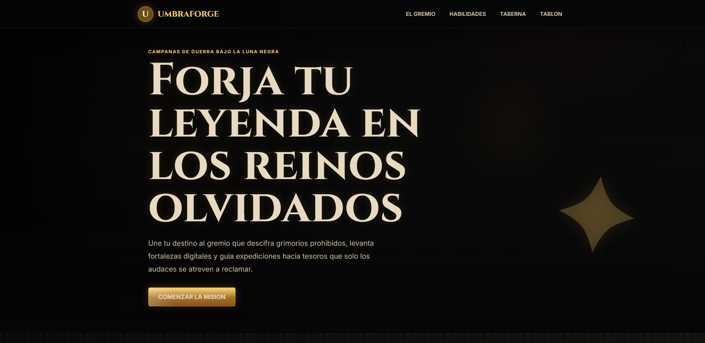
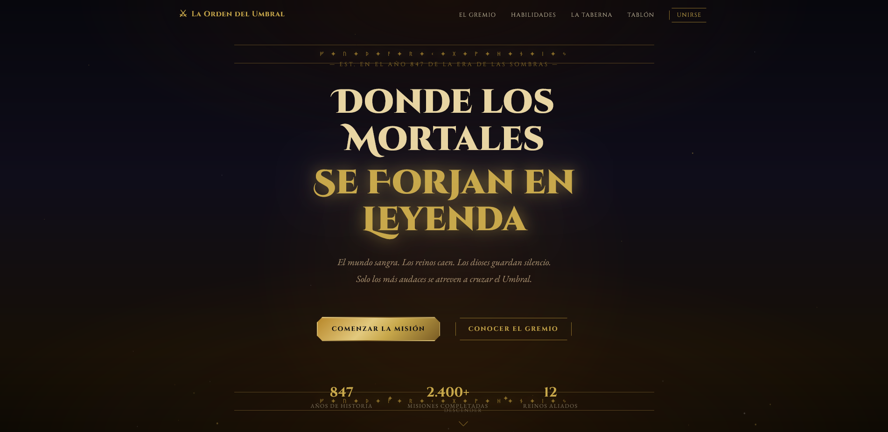

# PFO2: Prompt Engineering en Agentes de IA

Repositorio de la Práctica Formativa Obligatoria 2. El objetivo de este proyecto es diseñar y
estructurar un único prompt inicial de alta precisión para generar una Landing Page,
ejecutándolo en dos agentes de desarrollo distintos para comparar su capacidad de resolución autónoma.

## Datos del Estudiante

- **Nombre y Apellido:** Leandro Raúl Ferrero
- **Institución:** IFTS N.° 29
- **Carrera:** Tecnicatura Superior en Desarrollo de Software
- **Comisión:** D

## Deploy Unificado

🔗 **https://pfo2-prompt-engineering.vercel.app/**

_(El enlace dirige a la portada principal que contiene los accesos al texto del prompt y a las dos Landing Pages generadas)._

## Prompt Exacto Utilizado

```text
# ROL
Eres un Desarrollador Frontend Senior experto en HTML, CSS y JavaScript Vanilla
y diseño UI/UX, especializado en interfaces inmersivas. Tu objetivo es escribir
código limpio, modular y completamente funcional desde el primer intento.

# TAREA
Desarrollar una Landing Page estática y responsiva con una temática estricta de
videojuego RPG de fantasía oscura y rol de mesa (Dungeons & Dragons).

# ESTÉTICA Y DISEÑO UI/UX (TEMÁTICA RPG/D&D)
- Paleta de colores: Tonos oscuros (gris piedra de mazmorra, negro profundo),
  detalles en dorado, latón o ámbar (magia/fuego), y fondos que simulen
  texturas de pergaminos antiguos o madera para los contenedores.
- Tipografía: Utilizar fuentes de Google Fonts. Una fuente serif clásica o de
  estilo medieval para los títulos (ej. Cinzel, Merriweather, Playfair Display)
  y una fuente sans-serif altamente legible para los párrafos de texto.
- Estilo visual: La interfaz debe recordar a juegos de rol de alta calidad
  (estilo Baldur's Gate 3, Dungeons and Dragons o El señor de los anillos).
  Incluir bordes ornamentados en las tarjetas, botones que parezcan placas de
  metal o sellos de cera, y sombras pronunciadas (box-shadow) para dar
  profundidad.
- Copywriting (Textos): El contenido generado por defecto debe utilizar
  vocabulario de fantasía épica.

# REQUISITOS TÉCNICOS
- Framework: HTML5 semántico, CSS3 puro y JavaScript Vanilla (estrictamente
  sin frameworks ni librerías).
- Estilos: Utilizar CSS moderno en un único archivo separado. Implementar
  Flexbox/Grid para el layout.
- Animaciones: Incluir animaciones CSS inmersivas (ej. transiciones suaves en
  hover para los botones, efecto "fade-in" al cargar la página, o un brillo
  sutil en los elementos interactivos).
- Estructura de archivos: Generar estrictamente tres archivos: index.html,
  style.css y script.js. El HTML debe tener enlazados correctamente el CSS y
  el JS.

# ESTRUCTURA DE LA LANDING PAGE
La página debe contener obligatoriamente las siguientes secciones en orden
descendente:
1. Cabecera (Header): Barra de navegación con logo (texto) y enlaces.
2. Hero Section: Sección principal con un título épico de alto impacto visual
   y un botón de llamada a la acción (CTA) (ej. "Comenzar la Misión").
3. El Gremio / Sobre Nosotros: Breve descripción de la facción, gremio o
   empresa.
4. Habilidades / Servicios: Grilla destacando los servicios principales
   presentados como clases de personajes, talentos o hechizos.
5. Taberna / Testimonios: Reseñas simuladas de al menos tres aventureros o
   clientes.
6. El Tablón de Anuncios / Formulario de Contacto: Maquetado visual con
   campos de Nombre, Email, Mensaje y botón de envío (no requiere lógica
   backend, solo la interfaz UI).
7. Pie de Página (Footer): Copyright y enlaces simulados a redes sociales o
   "reinos aliados".

# RESTRICCIONES
- No omitir ninguna sección de la estructura solicitada.
- El código debe ser completo, sin marcadores de posición como
  "/* tu código aquí */".
- Entregar el código listo para ser renderizado.
- El código debe entregarse separado claramente en los bloques correspondientes
  a index.html, style.css y script.js.
```

## Capturas de Pantalla

### Agente 1: Codex (Modelo GPT-5.5)



### Agente 2: Claude Code (Modelo Sonnet 4.6)


